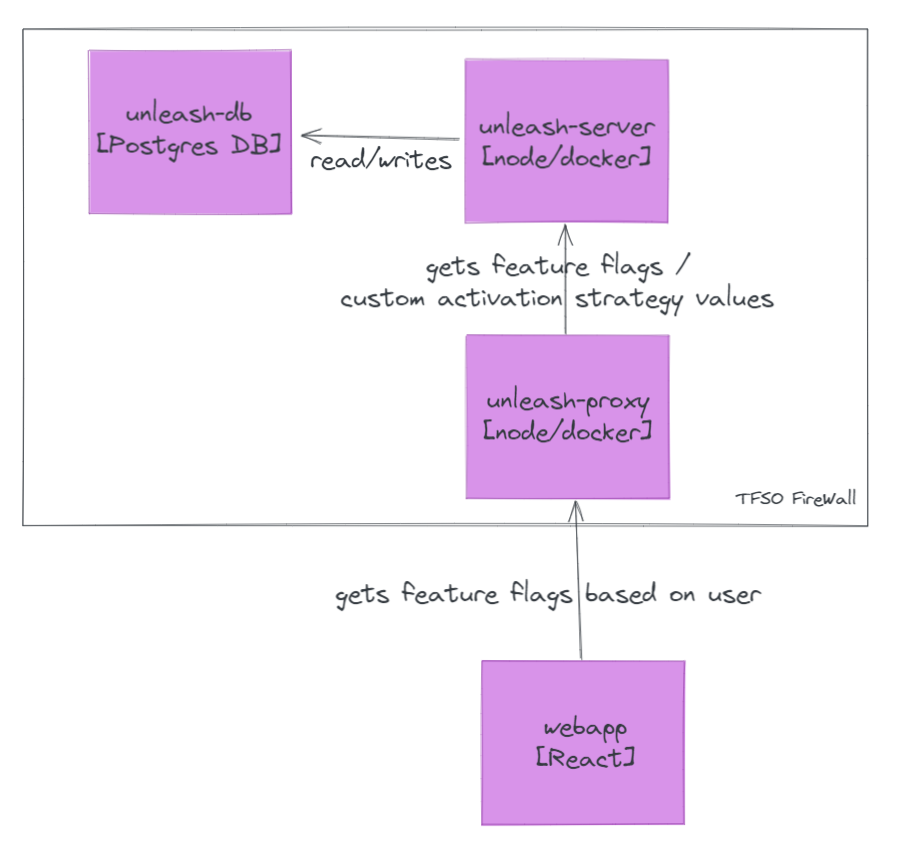

# Unleash

Unleash is a OSS system for managing feature toggles.

This demo is created to learn how it works, and how we might want to use it in 24SO if we want do start using feature flags more.
*We currently have [our own feature flag api](https://github.com/tfso/api-featureflag).*

**[GET ME TO THE DEMO](#demo-requires-docker-compose)**

## Motivation

The main motivation (it seems) behind using feature flags more heavily is separating deploy from release. The main benefits being:

- Easier to create short-lived branches, since we can hide code that is not yet ready behind a feature flag
- Product Owners/QA can easily toggle features based on userId/clientId/environment

## Architecture

Unleash mainly consists of two components:

- unleash-server - This is a Node.js server that runs Unleash, both used by clients to get feature toggles, and has a Admin UI
- unleash-db - Postgres DB that persists users, feature flags, strategies, API keys etc.

Clients can communicate directly to the API or via [various client SDKs](https://docs.getunleash.io/sdks).

Since we would be using the React SDK, we also need a third component.

- unleash-proxy - Sits between the unleash-server API and the frontend client, why?
    - Performance - caches all data from the API in-memory
    - Security - Evaluates feature flags for the user server-side, so it only exposes the results of feature flags to the specific user

This also means that we can use the unleash-proxy to create custom strategies, for example turning on toggles for certain Client IDs (more about that later).

The diagram below show a simplified C4 container diagram of a self-hosted Unleash setup:



## Demo (requires docker-compose)

This demo packs all the components into docker containers, do the following to get started (from sproject root):

```sh
# Will build unleash-server, unleash-proxy and webapp
docker-compose build
```

Then run:

```sh
docker-compose up
```

For some reason, the database healthcheck is not working, so wait for a few seconds, than press **CTRL+c** _once_ to exit.

Now you can run `docker-compose up` one more time, and everything should be working. The database will log something about a packet, that is just info.

Now you'll be able to reach:

- Unleash Server/UI: http://localhost:4242
- Unleash Proxy: http://localhost:3001/proxy
- Webapp: http://localhost:3000

### Unleash server

You can find the unleash server in the [unleash server in this directory](./unleash-server/index.js). It is possible to add express middleware that runs before unleash-server, but currently it is plain.

### Unleash proxy

The unleash proxy can be found in the [unleash proxy directory](./unleash-proxy/index.js). Here we have created a **custom activation strategy**: 

```js
const { Strategy } = require('unleash-client')

class ClientIdsStrategy extends Strategy {
    constructor() {
        // ClientIDs is the name of the custom activation strategy that we have created in Unleash
        super('ClientIDs')
    }

    // The first param is a list of clientIds that should be allowed, these will be defined for a specific feature toggle
    // The properties.clientId is sent from the webapp (user) during the request
    isEnabled({ clientIds }, { properties: { clientId } }) {
        return clientIds.indexOf(clientId) > -1
    }
}
```

You can see the activation strategy here: http://localhost:4242/strategies/view/ClientIDs. How this works is that we first _define_ the activation strategy in the Unleash UI. Then we can implement how it actually operates in the Unleash-proxy.
Check out the `feature.24so` toggle to see how to configure a toggle to only work for the client with ID 24: http://localhost:4242/projects/default/features/feature.24so/strategies

### Database

The database is a Postgres database, the one in the docker-compose uses an image I created for this demo `oysteinvesth/unleash_db_intro`. This has a few activation strategies, a custom activation strategy, and an API key the proxy uses.

### Webapp

Very simple CRA React app that implements the toggles that are defined in the Unleash server.

## How it works

### Feature toggles

This are named toggles that can be turned on or off. We can set who they should be turned on/off for be using activation strategies.

#### Variants

A feature toggle can have various variants. This can be used when doing A/B tests. There is an example of the variant being used in the demo.

### Activation strategies

These are strategies we can set on a toggle to define when it should be triggered. There are a few defaults like userId, IPs, gradual, etc.. The way it works is that the client that asks for feature flags, has a `context`. This context can include `sessionId`, `userId`, `hostname`, it also has a `properties` where the client can add _any_ properties they want.

It is also possible to create custom activation strategies. Here we create a name, and add properties that can be used for validation. Then we need to create an implementation for the strategy in our unleash proxy.

### Context

Additional metadata that is sent when getting feature toggles. Includes `sessionId`, `userId`, `hostname` and various custom properties under `properties`, example:

```js
{
    userId: 123,
    sessionId: '20sdflksdfl20',
    properties: {
        clientId: 123,
        country: 'norway'
    }
}
```

## OSS vs Pro/Enterprise

Some features are only available for Pro/Enterprise users:
- Pre-defined context properties [what is a context](#unleash-context)
- SSO
- Projects - enables possibility to group flags for different projects (CRM, Bank, Product, etc.)
- Custom activation strategies - is possible in free version as well, but must be done in the [unleash-proxy](#architecture)
- Constraints (ie. this activation strategy should only include users in Beta environment)

If we are going to use Unleash, we should discuss paying for Pro/Enterprise.